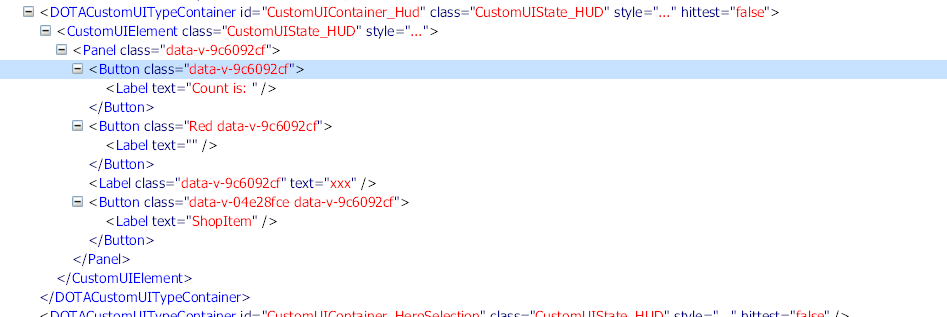

# Vue for Valve's Panorama UI

抽空适配，不一定成，没准有更好的方案出现。

Vue 项目编译范例: [panorama-vue-example](https://github.com/RobinCodeX/panorama-vue-example)

# 改动记录

2022/10/17

-   现在采用分包的形式，统一归纳到`@panorama-vue`

-   目前改造了`@vue/runtime-core`和`@vue/reactivity`两个官方库，因为 Vue 官方库存在很多`console`之类的 PUI 没有的 API，
    现在只是适配一下，后面可能会根据 PUI 的情况魔改。

-   适配已经快完成，截图如下，不过这是我强行修改编译后的代码才成功的，SFC 的编译有点问题，还需研究。
    
